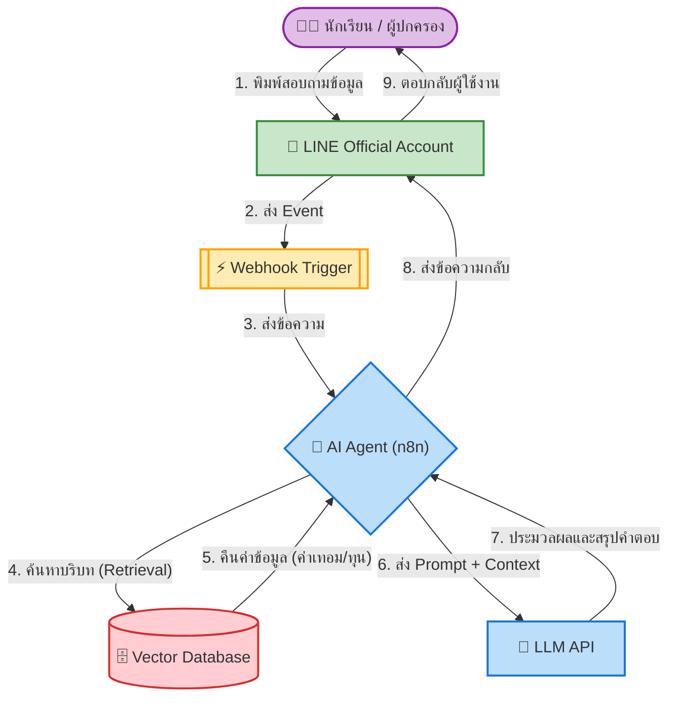

# 🎓 EduGuide: บอทแนะแนวการศึกษาต่อ (University Info RAG Chatbot)

**EduGuide** คือระบบแชทบอทอัจฉริยะที่ออกแบบมาเพื่อช่วยเหลือนักเรียนชั้น ม.ปลาย (TCAS) และผู้ปกครอง ในการสืบค้นข้อมูลประกอบการตัดสินใจเข้าศึกษาต่อระดับมหาวิทยาลัย โดยขับเคลื่อนด้วยเทคโนโลยี **RAG (Retrieval-Augmented Generation)** เพื่อให้คำตอบที่ถูกต้อง แม่นยำ และอ้างอิงจากข้อมูลจริง (Hard Data) เสมอ

## 🌟 Problem Statement
ข้อมูลสำคัญสำหรับการตัดสินใจเรียนต่อมหาวิทยาลัย เช่น ค่าเทอมตลอดหลักสูตร, ยอดกู้ กยศ., และทุนการศึกษา มักกระจัดกระจายอยู่ในหลายแพลตฟอร์ม (เว็บไซต์มหาวิทยาลัย, ไฟล์ PDF) ทำให้การค้นหาและเปรียบเทียบข้อมูลทำได้ยาก ระบบนี้จึงถูกสร้างขึ้นเพื่อรวบรวมข้อมูลที่มีโครงสร้าง (Structured Data) และให้บริการตอบคำถามแบบอัตโนมัติในที่เดียว

## ✨ Key Features (จุดเด่นของระบบ)
- **ETL Data Pipeline:** ระบบทำความสะอาดและจัดโครงสร้างข้อมูล (Data Cleansing & Structuring) จากไฟล์ PDF และ Web Data ให้พร้อมใช้งาน
- **Semantic Search:** ค้นหาข้อมูลมหาวิทยาลัยด้วยความหมายและบริบท ผ่าน Vector Database
- **No-Code/Low-Code Orchestration:** จัดการ Workflow การทำงานของ AI Agent ด้วย n8n
- **User-Friendly Interface:** ถาม-ตอบง่ายๆ ผ่านแอปพลิเคชัน LINE ที่ทุกคนคุ้นเคย

## 🏗️ System Architecture

ระบบของเราทำงานผ่าน Pipeline ดังนี้:




## 🔄 Data Engineering Pipeline (กระบวนการเตรียมและจัดการข้อมูล)

เนื่องจากหัวใจสำคัญของระบบ RAG คือความถูกต้องของข้อมูล (Data Quality) โปรเจกต์นี้จึงให้ความสำคัญกับกระบวนการ ETL (Extract, Transform, Load) เป็นอย่างมาก แผนภาพด้านล่างแสดงถึงขั้นตอนการจัดการข้อมูลตั้งแต่ต้นน้ำไปจนถึงการนำเข้าสู่ Vector Database ครับ:

```mermaid
flowchart TD
    classDef source fill:#e3f2fd,stroke:#1e88e5,stroke-width:2px,color:#000
    classDef extract fill:#fff3e0,stroke:#fb8c00,stroke-width:2px,color:#000
    classDef process fill:#e8f5e9,stroke:#43a047,stroke-width:2px,color:#000
    classDef ai fill:#f3e5f5,stroke:#8e24aa,stroke-width:2px,color:#000
    classDef db fill:#ffebee,stroke:#e53935,stroke-width:2px,color:#000

    subgraph Phase1 ["1. Data Sources (แหล่งข้อมูลตั้งต้น)"]
        S1["🌐 เว็บไซต์ TCAS"]:::source
        S2["🏫 เว็บไซต์มหาวิทยาลัย"]:::source
        S3["📄 ไฟล์ประกาศ (PDF)"]:::source
    end

    subgraph Phase2 ["2. Data Extraction (การรวบรวมข้อมูล)"]
        E1["🕷️ Web Scraping & Extract Data"]:::extract
        E2["📊 Raw Data (ข้อมูลดิบ)"]:::extract
    end

    subgraph Phase3 ["3. Data Processing & ETL (การทำความสะอาดข้อมูล)"]
        P1["🗂️ Data Structuring (จัดโครงสร้างตาราง)"]:::process
        P2["🧹 Data Cleaning (ลบขยะ, จัดรูปแบบ, เติมข้อมูล)"]:::process
        P3["🔗 Data Integration (เชื่อมตารางด้วย Key)"]:::process
        P4["✨ Cleaned Master Data (ไฟล์ CSV พร้อมใช้)"]:::process
    end

    subgraph Phase4 ["4. RAG Pipeline (เตรียมข้อมูลสู่ AI)"]
        A1["✂️ Text Chunking"]:::ai
        A2["🔢 Vector Embedding"]:::ai
        A3[("🗄️ Vector Database")]:::db
        A4["💬 RAG Chatbot"]:::db
    end

    S1 --> E1
    S2 --> E1
    S3 --> E1
    
    E1 --> E2
    E2 --> P1
    
    P1 --> P2
    P2 --> P3
    P3 --> P4
    
    P4 --> A1
    A1 --> A2
    A2 --> A3
    A3 --> A4


